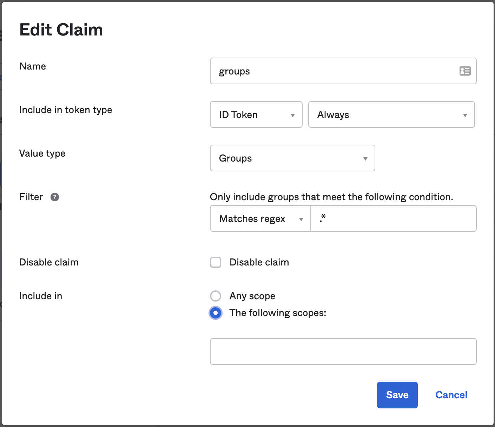
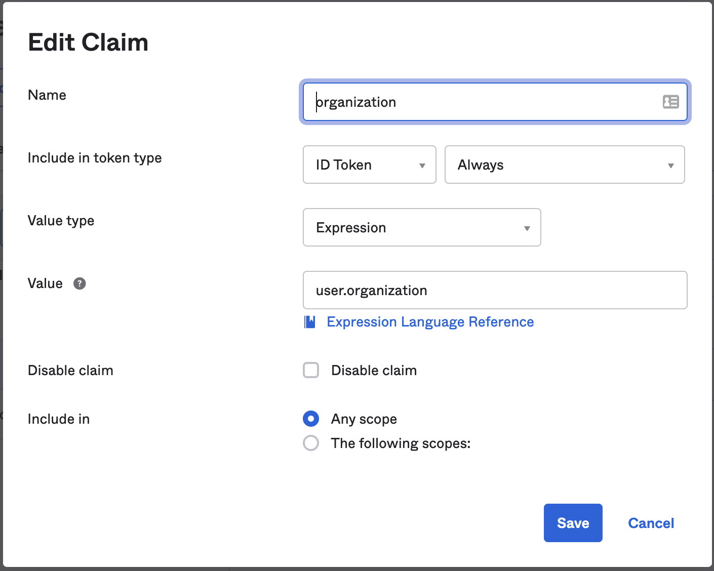

# Jmix Okta Integration Sample

The project demonstrates how to use Okta Identity Platform (https://www.okta.com/) together with Jmix OIDC add-on  for user management.

## Okta Groups Claim in ID Token

Jmix roles names will be taken from Okta group names assigned to the user. In order to return group names in ID Token, the groups claim must be explicitly added to the ID token. See [Okta documentation](hhttps://developer.okta.com/docs/guides/customize-tokens-groups-claim/main/#add-a-groups-claim-for-a-custom-authorization-server).



Roles claim name must be set in `application.properties`:

```properties
jmix.oidc.default-claims-roles-mapper.roles-claim-name=groups
```

## Multitenancy

In order to support multitenancy, the [MyUser](/src/main/java/com/company/oks/oidc/MyUser.java) class must implement the `AcceptsTenant` interface.

In this sample we use the value of the "organization" Okta user profile attribute is used as tenant id.

To return the "organization" claim in the ID token, the "organization" claim must defined. See [Okta documentation](https://developer.okta.com/docs/guides/customize-tokens-returned-from-okta/main/#request-a-token-that-contains-the-custom-claim).



The `OidcUserMapper` uses that sets the tenant id:

```java
@Component
public class MyOidcUserMapper extends BaseOidcUserMapper<MyUser> {
    
    //...
    
    @Override
    protected void populateUserAttributes(OidcUser oidcUser, MyUser jmixUser) {
        
        //...

        //use organization as tenant id
        String organization = (String) oidcUser.getClaims().get("organization");
        jmixUser.setTenantId(organization);
    }
    
}
```

## User Repository

Persistent `User` entity and user screens have been removed in this sample. The in-memory[MyUserRepository](/src/main/java/com/company/oks/security/MyUserRepository.java) is used for initializing of system and anonymous users.